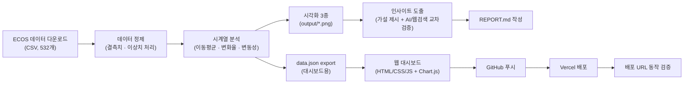
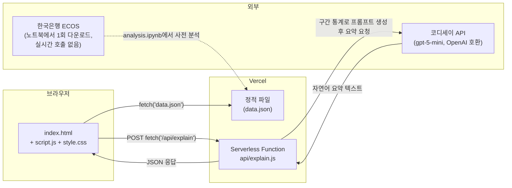
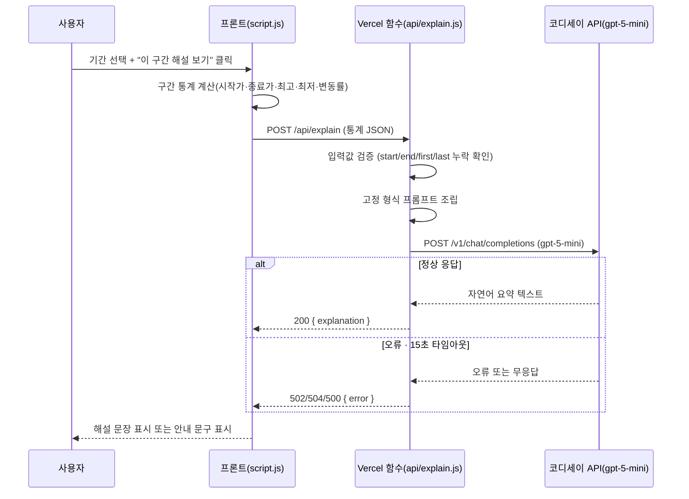

# 원/달러 환율 전광판 📈

> 한국은행 ECOS 원/달러 매매기준율을 시계열 분석하고, 기간을 자유롭게 조회하며 AI 해설까지 받아볼 수 있는 웹 대시보드

**🔗 배포 URL:** https://m1-1-gray.vercel.app
**💻 GitHub:** https://github.com/ilililililil4319/M1-1
**📄 결과보고서:** [`docs/2. 결과보고서_원달러 환율 시계열 트렌드 분석.md`](./docs/2.%20결과보고서_원달러%20환율%20시계열%20트렌드%20분석.md) ([PDF](./docs/2.%20결과보고서_원달러%20환율%20시계열%20트렌드%20분석.pdf))


---

## 목차

1. [프로젝트 소개](#1-프로젝트-소개)
2. [프로젝트 개요 및 산출물 구성](#2-프로젝트-개요-및-산출물-구성)
3. [폴더 구조](#3-폴더-구조)
4. [기술 스택](#4-기술-스택)
5. [데이터 설명 및 출처](#5-데이터-설명-및-출처)
6. [분석 방법 및 인사이트 요약](#6-분석-방법-및-인사이트-요약)
7. [전체 작업 순서 (STEP 1~23)](#7-전체-작업-순서-step-123)
8. [작업 흐름도 (평면도)](#8-작업-흐름도-평면도)
9. [코디세이 API 연동 구조](#9-코디세이-api-연동-구조)
10. [로컬 실행 방법](#10-로컬-실행-방법)
11. [Vercel 배포 방법 및 환경 변수](#11-vercel-배포-방법-및-환경-변수)
12. [배포 중 발생한 오류와 해결](#12-배포-중-발생한-오류와-해결)
13. [AI(Claude) 사용 로그 요약](#13-aiclaude-사용-로그-요약)
14. [기능요구사항 대비 결과](#14-기능요구사항-대비-결과)
15. [자체 점검 체크리스트](#15-자체-점검-체크리스트)
16. [GitHub 업로드 확인](#16-github-업로드-확인)
17. [보안 유의사항](#17-보안-유의사항)
18. [데이터 출처 및 라이선스 유의사항](#18-데이터-출처-및-라이선스-유의사항)
19. [기타](#19-기타)

---

## 1. 프로젝트 소개

원/달러 환율은 뉴스에서 매일 언급되지만, "지금 오르는 추세인지", "이 정도 변동이 평소보다
큰 건지"를 숫자 근거로 판단하기는 쉽지 않습니다. 대부분 헤드라인 몇 개에 의존해 감으로
판단하는 경우가 많습니다.

이 프로젝트는 한국은행이 공개하는 **원/달러 매매기준율** 데이터를 정제·분석하여, 관찰
(그래프에서 확인한 사실)과 해석(가능한 원인 가설)을 구분해 정리한 **인사이트 리포트**를
작성하고, 이를 기간별로 자유롭게 탐색할 수 있는 **웹 대시보드**로 구현한 개인 프로젝트입니다
(AI Native Master 미션과제 M1-1).

- **분석 대상:** 원/달러 매매기준율 일별 종가 (2024-07-01 ~ 2026-09-03, 532개)
- **핵심 가치:** 감이 아닌 "실제 데이터"로 환율 흐름을 판단하고, AI 해설로 쉽게 이해
- **보너스:** 분석 결과를 기간 필터가 가능한 웹 대시보드로 서비스화 + Vercel 배포

---

## 2. 프로젝트 개요 및 산출물 구성

| 항목 | 내용 |
|---|---|
| 과제명 | AI 데이터 분석: 데이터 기반 트렌드 분석 (미션과제 M1-1) |
| 분석 주제 | 원/달러 환율 시계열 트렌드 분석 |
| 작성 형태 | 개인 프로젝트 (1인 수행) |
| 사용 AI 도구 | Claude(Anthropic, 분석/코드 생성·디버깅·웹검색 보조),<br/>코디세이 API `gpt-5-mini`(대시보드 AI 해설) |
| 보너스 과제 | 분석 결과 서비스화 — 기간 필터링 가능한<br/>웹 대시보드 (Vercel 배포) |

**산출물 구성**

| 산출물 | 형식 | 위치 |
|---|---|---|
| 분석 리포트 | REPORT.md | 루트 |
| 기획서 | PDF + md | `docs/` |
| 결과보고서 | PDF + md | `docs/` |
| 분석 코드 | Jupyter Notebook | `notebook/analysis.ipynb` |
| 시각화 | PNG 3종 | `output/` |
| 대시보드(보너스) | HTML/CSS/JS + Vercel 배포 | `web/`, https://m1-1-gray.vercel.app |
| 증빙 스크린샷 | PNG 45장 | `screenshots/` |

---

## 3. 폴더 구조

README와 결과보고서가 어디에 있는지 먼저 확인하세요.

```
M1-1/
├── README.md                          ← 지금 보고 있는 파일 (폴더를 열면 가장 먼저 보임)
├── REPORT.md                          # 분석 리포트 (최종 결과물, 관찰-해석 구분)
├── requirements.txt                   # Python 의존성 목록
├── codyssey_api.py                    # 코디세이 API 연동 테스트 모듈
├── .env                                # 로컬 API 키 (git 제외 대상)
├── .gitignore
│
├── data/
│   ├── exchange_rate.csv              # 원본 데이터 (ECOS 다운로드)
│   └── exchange_rate_clean.csv        # 정제 + 이동평균/변화율/변동성 포함
│
├── docs/                              # 기획서 · 결과보고서 (PDF + md)
│   ├── 1. 기획서_원달러 환율 시계열 트렌드 분석.pdf
│   ├── 1. 기획서_원달러 환율 시계열 트렌드 분석.md
│   ├── 2. 결과보고서_원달러 환율 시계열 트렌드 분석.pdf   ← 결과보고서는 여기
│   └── 2. 결과보고서_원달러 환율 시계열 트렌드 분석.md    ← 결과보고서는 여기
│
├── notebook/
│   └── analysis.ipynb                 # 데이터 로드부터 JSON export까지 전체 분석 코드
│
├── output/                            # 시각화 결과 (PNG 3종, 리포트에 개별 삽입)
│   ├── 01_price_trend_ma.png
│   ├── 02_monthly_change.png
│   └── 03_volatility.png
│
├── screenshots/                       # 작업 과정 증빙 스크린샷 (총 45장, 01~45)
│
└── web/                                # 대시보드 (Vercel 배포 루트 = 이 폴더)
    ├── index.html
    ├── style.css
    ├── script.js                      # 차트 렌더링 · 기간 필터 · AI 해설 호출
    ├── data.json                      # 분석 결과 export (대시보드용)
    └── api/
        └── explain.js                 # 코디세이 API 서버리스 함수 (AI 해설 생성)
```

---

## 4. 기술 스택

| 구분 | 내용 |
|---|---|
| 분석 환경 | Python 3.14, VS Code, Jupyter |
| 데이터 처리 | pandas, numpy |
| 시각화 | matplotlib |
| 대시보드 프론트 | HTML / CSS / JavaScript(바닐라), Chart.js |
| AI 해설 API | 코디세이 API(`gpt-5-mini`, OpenAI 호환) |
| 배포 | Vercel(정적 페이지 + Serverless Function) |
| 버전관리 | Git / GitHub |
| 데이터 출처 | 한국은행 경제통계시스템(ECOS) |

---

## 5. 데이터 설명 및 출처

| 항목 | 내용 |
|---|---|
| 출처 | 한국은행 경제통계시스템(ECOS)<br/>https://ecos.bok.or.kr/#/ |
| 통계표 경로 | 3.1.1.3. 원화의 대미달러,<br/>원화의 대위안/대엔 환율 |
| 계정항목 | 원/달러(종가) |
| 기간 | 2024-07-01 ~ 2026-09-03 |
| 주기 | 일별 |
| 데이터 개수 | 532개 (요구사항 100개 이상 충족) |
| 다운로드 형식 | CSV |
| 원본 파일 | `data/exchange_rate.csv` |
| 정제 파일 | `data/exchange_rate_clean.csv` |

**ECOS에서 데이터를 내려받은 과정**

| ① 통계 검색 | ② 계정항목·기간 설정 | ③ CSV 다운로드 |
|:---:|:---:|:---:|
|  |  |  |

1. ECOS(https://ecos.bok.or.kr/#/) 접속 후 "환율"로 통합검색
2. 좌측 통계 트리에서 `3.환율/통관수출입/외환보유액 → 3.1.환율 → 3.1.1.일일환율 → 3.1.1.3.원화의 대미달러, 원화의 대위안/대엔 환율` 선택
3. 계정항목에서 **원/달러(종가)** 체크 → 조회 기간(2024-07-01~2026-09-03) 설정 → 조회
4. "자료받기" → **CSV** 형식으로 다운로드

**데이터 정제 결과**

| ① 결측치 처리 후 (0건) | ② 이상치 확인 결과 (0건) |
|:---:|:---:|
|  |  |

- **결측치 2건**(2024-12-31, 2025-12-31, 둘 다 12월 31일 반휴장일 추정) → 전일 종가로 채움(forward fill)
- **이상치 0건**(IQR 기준, 정상범위 1259.9~1593.4원) — 단, "레벨" 기준일 뿐 "하루 변화율" 기준으로는
  뚜렷한 급등락일이 존재함 (아래 인사이트 참고)

데이터 설명·정제 기준의 전체 근거는 [`REPORT.md`](./REPORT.md#3-데이터-설명)와
[결과보고서](./docs) 3장에서 자세히 다룹니다.

---

## 6. 분석 방법 및 인사이트 요약

**적용한 시계열 기법 3가지**

| 기법 | 설명 |
|---|---|
| 이동평균(Moving Average) | 20일·60일 이동평균으로 단기/중기 추세 확인 |
| 일간 변화율(Rate of Change) | 전일 대비 변화율(%)로 급등락 시점 포착 |
| 변동성(Volatility) | 20일 구간 표준편차로 시기별 변동폭 비교 |

**시각화 3종**

| ① 추이 & 이동평균 | ② 월별 평균 변동률 | ③ 20일 구간 변동성 |
|:---:|:---:|:---:|
|  |  |  |

**인사이트 요약 (자세한 관찰·해석은 REPORT.md 5장 참고)**

1. **2026-03-03 급등(+3.17%)** — 이란-미국 전쟁(2026-02-28 발발) 여파로 안전자산 선호 심리가
   강해지며 원화 약세 압력이 발생했을 가능성. *(이 가설은 학습자가 먼저 제시했고, AI가 웹
   검색으로 실제 발발일·종전 협상 일정을 검증했습니다 — 13장 AI 사용 로그 참고)*
2. **2024-12-03 급등(+1.66%)** — 비상계엄 선포로 정치적 불확실성이 급격히 커지며 원화 약세
   압력 발생. *(이 가설은 AI가 먼저 제시했고, 학습자가 웹 검색으로 재검증했습니다)*
3. **2026년 7~9월 3개월 연속 하락** — 미·이란 종전 협상 종료, 연준 통화정책 전망 변화,
   수출기업 달러 매도 물량 증가 등 복합 요인으로 원화 강세(환율 하락) 국면 지속

---

## 7. 전체 작업 순서 (STEP 1~23)

| STEP | 작업 내용 | 증빙 |
|:---:|---|:---:|
| 1 | 기획서 작성 (목적·질문·로드맵 정의) | `docs/1.기획서` |
| 2 | 폴더 구조 초기화 + GitHub 저장소 + `.gitignore` 설정 | 01 |
| 3 | ECOS 통계 검색 및 계정항목·기간 설정 | 02, 03 |
| 4 | CSV 데이터 다운로드 | 04 |
| 5 | VS Code 확장(Python/Jupyter) 설치 및 커널 선택 | 05, 06, 07 |
| 6 | 가상환경(venv) 생성 및 작업 위치 확인 | 08, 09, 10 |
| 7 | 데이터 로드 및 기본 정보 확인(`df.info()`) | 11 |
| 8 | 결측치 확인 및 전일값 채움 처리 | 12, 13, 14, 15 |
| 9 | 이상치(IQR) 확인 | 16, 17 |
| 10 | 이동평균·변화율·변동성 계산 | 18, 19 |
| 11 | 시각화 3종 제작(`output/`) | 20, 21 |
| 12 | 인사이트 후보(급등락 TOP5) 확인 | 22, 23 |
| 13 | AI(Claude)로 급등락일-실제 사건 연결 가설 검증 | 24 |
| 14 | 대시보드용 `data.json` export 및 오류 수정 | 25, 26, 27, 28 |
| 15 | 대시보드 프론트(HTML/CSS/JS) 로컬 미리보기 | 29, 30 |
| 16 | 로컬 버그 수정(JSON 수정, 최저가 0 표시 등) | 31, 32, 33, 34 |
| 17 | 코디세이 API 연동 테스트(`codyssey_api.py`) | — |
| 18 | 서버리스 함수(`api/explain.js`) 작성 및 GitHub 푸시 | — |
| 19 | Vercel 프로젝트 생성 및 1차 배포 시도 | 35, 36 |
| 20 | 배포 후 AI 해설 401 인증 오류 발생 → 환경변수 재확인 → 재배포 | 37, 38, 39 |
| 21 | 배포 정상 동작 확인(AI 해설 성공 + 기간 필터 3종 시나리오) | 40, 41, 42, 43 |
| 22 | Vercel 서버리스 함수 로그 확인(200/502 이력) | 44 |
| 23 | GitHub 최종 커밋 확인 + README·결과보고서 정리 | 45 |

---

## 8. 작업 흐름도 (평면도)

### 8-1. 전체 분석 파이프라인



### 8-2. 대시보드 아키텍처 개요



### 8-3. AI 해설 요청 시퀀스



---

## 9. 코디세이 API 연동 구조

코디세이 API(`gpt-5-mini`, OpenAI 호환)는 이 프로젝트에서 **두 단계**로 사용했습니다.

### 9-1. 로컬 연동 테스트 — `codyssey_api.py`

대시보드를 만들기 전, "이 키·엔드포인트로 실제 응답이 오는가"만 확인하기 위한 별도
테스트 모듈입니다. OpenAI 파이썬 SDK를 그대로 쓰되 `base_url`만 코디세이 주소로 교체했습니다.

```python
client = OpenAI(
    api_key=os.getenv("CODYSSEY_API_KEY"),   # .env에서 키 읽기
    base_url="https://copa.codyssey.kr/v1"   # 코디세이 주소
)
```

이 파일은 웹 서비스에는 포함되지 않고, 로컬에서 키가 정상 작동하는지 확인하는 용도로만
사용했습니다.

### 9-2. 대시보드 연동 — `web/api/explain.js` (Vercel Serverless Function)

**API 키를 브라우저 JS에 두면 개발자 도구에서 그대로 노출**되기 때문에, 실제 대시보드에서는
코디세이 API를 **브라우저가 아니라 Vercel 서버가 대신 호출**하는 구조로 설계했습니다.

1. 사용자가 기간을 선택하고 "이 구간 해설 보기"를 누르면, `script.js`가 원본 데이터 전체가
   아니라 **선택 구간의 통계 값만**(시작가/종료가/최고가/최저가/변동률/데이터 수) 계산합니다.
2. 이 통계 값을 `POST /api/explain`으로 전송합니다. → 원본 시계열 전체를 서버에 보내지 않아
   전송량과 노출 정보를 최소화합니다.
3. `explain.js`가 아래처럼 **고정 형식 프롬프트**를 조립해 코디세이 API를 호출합니다.

```javascript
const prompt = `당신은 환율 데이터를 일반인이 이해하기 쉽게 설명하는 애널리스트입니다.
...
조건:
1. 데이터에 근거한 사실만 서술하고, 추측성 투자 조언은 하지 않는다.
2. "이 기간 원/달러 환율은 O% 상승/하락했습니다" 형태로 핵심 변동을 1~2문장으로 요약한다.
3. 전문 용어 대신 일반인이 이해할 수 있는 표현을 사용한다.
4. 3문장을 넘기지 않는다.`;
```

4. 응답 텍스트만 프론트로 반환하고, API 키는 `process.env.CODYSSEY_API_KEY`로만 서버 안에서
   접근합니다(프론트엔드 코드에는 키가 전혀 등장하지 않음).

**오류 처리**

| 상황 | 처리 |
|---|---|
| 필수 값 누락(start/end/first/last) | 400 응답 |
| 서버에 API 키 미설정 | 500 응답 |
| 코디세이 API 응답 실패 | 502 응답 + 원문 오류 메시지 포함 |
| 15초 초과(AbortController) | 504 응답, "잠시 후 다시 시도해주세요" 안내 |

실제 운영 중 Vercel 함수 로그에서 502(일시적 실패)와 200(정상)이 함께 기록된 것을 확인했습니다.
최초 배포 시에는 환경변수 값 오류로 401 인증 실패가 발생했다가(38번) 재배포 후 정상화된
이력이 있습니다(39, 40번) — 12장에서 자세히 다룹니다.


---

## 10. 로컬 실행 방법

### 분석 코드 실행

```bash
# 1. 가상환경 생성 및 활성화 (Windows 기준)
python -m venv .venv
.venv\Scripts\activate

# 2. 패키지 설치
pip install -r requirements.txt

# 3. Jupyter Notebook 실행
#    VS Code에서 notebook/analysis.ipynb 열고 "모두 실행"
```

`analysis.ipynb`를 처음부터 끝까지 실행하면 데이터 로드 → 결측치/이상치 처리 → 시계열 분석
(이동평균/변화율/변동성) → 시각화 3종(`output/`) → 대시보드용 `web/data.json`까지 순서대로
생성됩니다.

### 대시보드 로컬 미리보기

`web/index.html`을 더블클릭으로 열면 `data.json`을 못 불러옵니다(브라우저 보안 정책). 반드시
로컬 서버로 열어야 합니다.

- **VS Code Live Server 확장** 설치 → `web/index.html` 우클릭 → "Open with Live Server"

로컬 미리보기에서는 그래프·기간 필터까지는 확인 가능하지만, **"AI 해설 보기" 버튼은 동작하지
않습니다**(서버리스 함수는 Vercel 배포 환경에서만 실행됨).

---

## 11. Vercel 배포 방법 및 환경 변수

1. GitHub 저장소를 Vercel과 연동(Import Project)
2. **Root Directory를 `web`으로 지정**(저장소 전체가 아니라 `web` 폴더만 배포 대상)
3. **Environment Variables**에 `CODYSSEY_API_KEY` 추가(코디세이에서 발급받은 키)
4. Deploy

| ① Vercel 연동 시도 | ② 배포 완료 |
|:---:|:---:|
|  |  |

**환경 변수**

| 변수명 | 설명 | 사용 위치 |
|---|---|---|
| `CODYSSEY_API_KEY` | 코디세이 API 인증 키 | 로컬 `.env`(커밋 안 됨) /<br/>Vercel Environment Variables |

로컬 개발 시 프로젝트 루트에 `.env` 파일을 만들고 아래처럼 작성합니다.
```
CODYSSEY_API_KEY=발급받은_키
```
이 파일은 `.gitignore`에 등록되어 있어 GitHub에는 올라가지 않습니다.

---

## 12. 배포 중 발생한 오류와 해결

| 오류 | 원인 | 해결 | 증빙 |
|---|---|---|:---:|
| Jupyter 커널 재시작 후<br/>`NameError` | 커널 메모리가 초기화되어<br/>이전 실행 결과(변수)가 사라짐 | "모두 실행"으로<br/>처음부터 재실행 | — |
| `data.json` 파싱 실패<br/>(`NaN` 관련) | 이동평균 초반 구간의 결측값이<br/>표준 JSON에 없는 `NaN`으로 저장됨 | `pd.notnull` 처리로<br/>`NaN`을 `null`로 변환 후 저장 | 25, 26, 27, 28 |
| 대시보드 최저가가<br/>0으로 표시 | `Math.min()` 계산 시<br/>`null` 값이 0으로 취급됨 | 통계 계산 전<br/>`null` 값을 배열에서 필터링 | 32, 33, 34 |
| Vercel 배포 시<br/>"Python 프로젝트"로 오인식 | 저장소 루트에 `requirements.txt`,<br/>`codyssey_api.py`가 있어 Vercel이 오판 | Root Directory를<br/>`web`으로 지정해 해결 | — |
| AI 해설 401<br/>인증 오류 | Vercel 환경변수에 입력한<br/>API 키 값 오류 | 환경변수 값 재확인 후<br/>Redeploy | 38, 39, 40 |

---

## 13. AI(Claude) 사용 로그 요약

| 사용 작업 | 사용 이유 | 검증 방법 |
|---|---|---|
| 데이터 로드·정제 코드 작성<br/>(ECOS CSV → DataFrame,<br/>결측치 처리) | 가로형 CSV를 분석하기 쉬운<br/>세로형으로 변환하는<br/>반복 작업 시간 절감 | `df.info()`, `df.head()`,<br/>`df.tail()`로 직접 데이터 확인 |
| 이동평균·변화율·변동성<br/>계산 및 시각화 코드 작성 | 시계열 분석 기법을<br/>빠르게 구현하기 위해 | 그래프 육안 확인 +<br/>계산된 수치(TOP5 급등락일)<br/>재확인 |
| 급등락일과 실제 사건의<br/>연결(비상계엄) | 특정 날짜에 어떤 사건이<br/>있었는지 빠르게 조사 | AI가 먼저 제시한 가설을<br/>웹 검색으로 직접 재검증 |
| 급등락일과 실제 사건의<br/>연결(이란-미국 전쟁) | 학습자가 먼저 제시한 가설의<br/>사실관계(발발일·종전 협상 일정)<br/>확인 | AI가 웹 검색으로<br/>날짜·사실관계를 교차 확인,<br/>최종 문장은 직접 작성 |

> 두 인사이트 모두 "AI가 제시한 가설을 결론으로 바로 쓰지 않고, 근거를 검증한 뒤에만 리포트에
> 반영한다"는 동일한 원칙을 따랐습니다. 다만 **가설을 먼저 제시한 주체는 사례마다 다릅니다** —
> 비상계엄 연결은 AI가 먼저 제안했고, 이란-미국 전쟁 연결은 학습자가 먼저 제안한 뒤 AI가 웹
> 검색으로 사실관계(2026-02-28 발발, 2026-06-18 종전 MOU)를 검증했습니다.

**증빙 — Claude가 웹 검색으로 사실을 확인하는 과정**


자세한 내용은 [`REPORT.md`](./REPORT.md#7-ai-사용-로그)와 결과보고서 3장을 참고하세요.

---

## 14. 기능요구사항 대비 결과

| 요구사항 | 구현 위치 | 달성 |
|---|---|:---:|
| 데이터 100개 이상<br/>+ 출처/기간 명시 | `data/exchange_rate.csv`<br/>(532개, ECOS) | ✅ |
| 분석 질문 3개 이상 | `REPORT.md` 2장 | ✅ |
| 결측치/이상치<br/>확인 및 처리 | `notebook/analysis.ipynb`,<br/>`REPORT.md` 3장 | ✅ |
| 시계열 기법<br/>2개 이상 적용 | 이동평균·변화율·변동성<br/>(3개) | ✅ |
| 시각화 2개 이상 | `output/*.png`(3개) | ✅ |
| 인사이트 3개 이상<br/>(관찰-해석 구분) | `REPORT.md` 5장 | ✅ |
| AI 사용 로그 작성 | `REPORT.md` 7장,<br/>본 문서 13장 | ✅ |
| API 키 미노출 | `.env` + `.gitignore` | ✅ |
| 대시보드(보너스) | `web/` + Vercel 배포 | ✅ |
| 기간 필터 시나리오(보너스) | 스크린샷 3종<br/>(6/3/1개월) | ✅ |

---

## 15. 자체 점검 체크리스트

- [x] 데이터 100개 이상 + 출처/기간 명시
- [x] 분석 질문 3개 이상
- [x] 결측치/이상치 처리 및 근거 서술
- [x] 시계열 기법 2개 이상 적용
- [x] 시각화 2개 이상(권장 3개) 반영
- [x] 인사이트 3개 이상, 관찰-해석 구분
- [x] AI 사용 로그 작성(가설을 먼저 제시한 주체까지 명확히 구분)
- [x] API 키 미노출(로컬 `.env`, Vercel 환경변수로만 관리)
- [x] (보너스) 대시보드 기간 필터 정상 동작
- [x] (보너스) 대시보드 스크린샷 세트 및 필터/기간 변경 시나리오 설명 작성
- [x] README에 폴더 구조 · 작업 순서 · 작업 흐름도 · 코디세이 API 구조 · 보안사항 반영

---

## 16. GitHub 업로드 확인

전체 커밋 이력과 폴더 구조가 GitHub 저장소에 정상적으로 반영된 것을 확인했습니다.


- 저장소: https://github.com/ilililililil4319/M1-1
- `data/`, `docs/`, `notebook/`, `output/`, `screenshots/`, `web/` 폴더 및 루트 문서 파일 전체 업로드 완료
- `.env`는 `.gitignore`에 의해 커밋 이력에서 제외됨(아래 17장 참고)

---

## 17. 보안 유의사항

- **API 키 관리:** 코디세이 API 키는 코드에 직접 작성하지 않고, 로컬은 `.env`, 배포 환경은
  Vercel Environment Variables로만 관리합니다.
- **`.gitignore` 등록:** `.env`는 `.gitignore`에 등록되어 있어 GitHub 이력에 노출되지
  않습니다. 커밋 전에는 항상 `git status`로 `.env`가 스테이징되지 않았는지 확인합니다.
- **프론트엔드 비노출 구조:** `index.html`, `script.js`에는 API 키가 전혀 포함되지 않으며,
  키는 서버리스 함수(`api/explain.js`) 안에서만 `process.env`로 접근합니다.
- **공용 PC 작업 시:** GitHub/Vercel 로그인 정보를 브라우저에 저장하지 않고, 작업 종료 시
  로그인 세션과 로컬 `.env` 파일 상태를 확인·정리합니다.
- **키 유출 대응 원칙("폐기가 먼저, 정리는 그다음"):**
  1. 코디세이 콘솔에서 유출된 키를 즉시 폐기
  2. 새 키를 발급받아 로컬 `.env`와 Vercel 환경변수를 모두 교체
  3. Redeploy로 새 키가 실제 반영되었는지 확인
  4. 만약 키가 커밋 이력에 남아있다면, 키 폐기가 끝난 뒤 별도로 이력 정리 진행

---

## 18. 데이터 출처 및 라이선스 유의사항

- 데이터 출처: [한국은행 경제통계시스템(ECOS)](https://ecos.bok.or.kr/#/) — 3.1.1.3. 원화의
  대미달러, 원화의 대위안/대엔 환율(원/달러 종가)
- 본 프로젝트는 학습 목적의 분석이며, **투자 조언이 아닙니다.**
- 대시보드의 AI 해설 역시 사실 기반 요약만 생성하도록 프롬프트에서 투자 조언을 명시적으로
  금지하고 있습니다(9-2장 참고).

---

## 19. 기타

- 구현 과정에서 발생한 오류와 해결 과정은 12장과 `REPORT.md` 4장(결과보고서 Ⅳ장)에 함께
  기록했습니다.
- AI(Claude)는 코드 작성·디버깅·인사이트 사실관계 검증(웹 검색)에 활용했으며, 최종 해석·결론
  문장은 직접 작성했습니다.
- 향후 개선 방향(금리차·유가 등 추가 변수 반영, 기간 비교 기능, AI 해설 신뢰구간 명시 등)은
  결과보고서 Ⅶ장에 정리되어 있습니다.

---

*본 프로젝트는 M1-1 미션(AI 데이터 분석: 데이터 기반 트렌드 분석)의 결과물로 작성되었습니다.*
