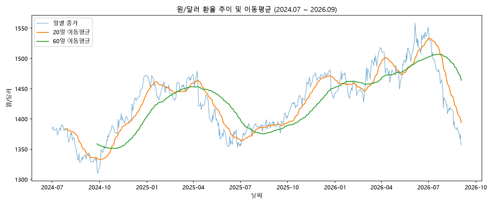
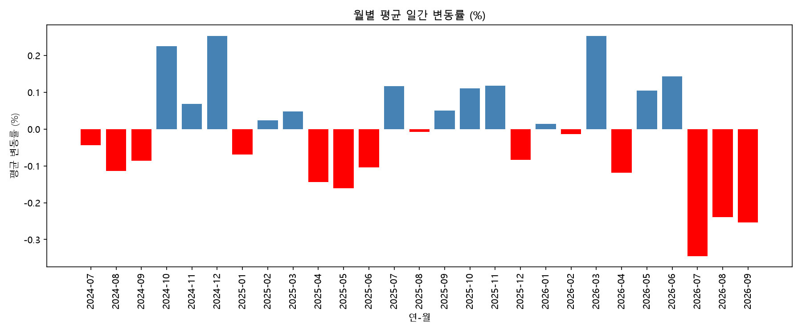
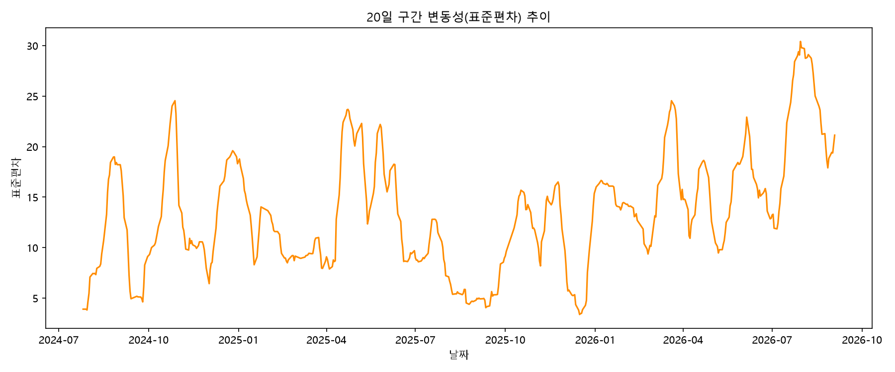

# 원/달러 환율 시계열 트렌드 분석 리포트

| 항목 | 내용 |
|---|---|
| 과제명 | AI 데이터 분석: 데이터 기반 트렌드 분석 (미션과제 M1-1) |
| 분석 주제 | 원/달러 환율 시계열 트렌드 분석 |
| 배포 URL | https://m1-1-gray.vercel.app |
| GitHub 저장소 | github.com/ilililililil4319/M1-1 |

## 목차
1. 분석 주제 및 선정 이유
2. 분석 질문 (3개 이상)
3. 데이터 설명
4. 프로젝트 폴더 구조
5. 분석 결과 및 시각화
6. 인사이트 (3개 이상, Fact–Why–Action 구조)
7. 결론, 한계점 및 AI 사전평가 반영
8. 보너스 — 시스템 구조 및 코디세이 API 연동 (대시보드 서비스화)
9. 오류 처리 이력 정리
10. AI 사용 로그
11. 요구사항 대비 최종 구현 결과
12. 자체 점검 체크리스트
13. 최종 제출물
14. 기타 — 소감 및 향후 개선 방향

---

## 1. 분석 주제 및 선정 이유

원/달러 환율은 뉴스에서 매일 언급되지만, "지금 오르는 추세인지", "이 정도 변동이 평소보다 큰 건지"를 숫자 근거로 판단하기는 쉽지 않다. 대부분 헤드라인 몇 개에 의존해 감으로 판단하는 경우가 많다.

이 프로젝트는 한국은행이 공개하는 원/달러 매매기준율 데이터를 정제·분석하여, 관찰(그래프에서 확인한 사실)과 해석(가능한 원인 가설)을 구분해 정리한 인사이트 리포트를 작성하는 것을 목표로 한다. 보너스 과제로, 분석 결과를 기간별로 탐색하고 AI 해설까지 받아볼 수 있는 웹 대시보드를 구현해 Vercel에 배포했다(배포 URL: https://m1-1-gray.vercel.app).

---

## 2. 분석 질문 (3개 이상)

1. 2024~2026년 전체적으로 원/달러 환율은 상승/하락 추세가 있었는가?
2. 급등락 구간은 언제이며, 외부 이벤트(정치·국제 이슈 등)와 연결해볼 수 있는가?
3. 월별로 변동 패턴이 다른가? 특정 시기가 유독 변동성이 크거나 작았는가?

---

## 3. 데이터 설명

| 항목 | 내용 |
|---|---|
| 출처 | 한국은행 경제통계시스템(ECOS)<br/>https://ecos.bok.or.kr/#/ |
| 통계표 경로 | 3.1.1.3. 원화의 대미달러,<br/>원화의 대위안/대엔 환율 |
| 계정항목 | 원/달러(종가) |
| 기간 | 2024-07-01 ~ 2026-09-03 |
| 주기 | 일별 |
| 데이터 개수 | 532개 (요구사항 100개 이상 충족) |
| 원본 파일 | `data/exchange_rate.csv` |
| 정제 파일 | `data/exchange_rate_clean.csv` |

### 데이터 수집 과정 (ECOS)

한국은행 ECOS에서 원/달러 매매기준율 데이터를 다음 순서로 내려받았다.

1. ECOS 접속 후 "환율"로 통합검색
2. 좌측 통계 트리에서 `3.환율/통관수출입/외환보유액 → 3.1.환율 → 3.1.1.일일환율 → 3.1.1.3.원화의 대미달러, 원화의 대위안/대엔 환율` 선택
3. 계정항목에서 **원/달러(종가)** 체크 → 조회 기간(2024-07-01~2026-09-03) 설정 → 조회
4. "자료받기" → **CSV** 형식으로 다운로드

| ① 통계 검색 | ② 계정항목·기간 설정 | ③ CSV 다운로드 |
|:---:|:---:|:---:|
|  |  |  |

### 데이터 정제

한국은행 ECOS에서 받은 CSV를 pandas로 불러와 컬럼명을 정리했다.


- **결측치**: 2건 발견(2024-12-31, 2025-12-31). 두 날 모두 12월 31일로, 반휴장일 등의 사유로 매매기준율이 고시되지 않은 것으로 추정된다. 하루짜리 결측이며 전후 변동성이 크지 않은 시기라 판단하여, **전일 종가로 채우는 방식(forward fill)**으로 처리했다.
- **이상치**: IQR(사분위범위) 기준으로 확인한 결과, 원/달러 값 자체에는 이상치가 0건이었다(정상범위 1259.9~1593.4원). 다만 이는 "레벨(원화 값)" 기준 판단이며, "하루 변화율" 기준으로는 뚜렷하게 튀는 날짜들이 존재했다(6장 인사이트 참고). 레벨 기준 이상치가 없다고 해서 급등락이 없었다는 뜻은 아니라는 점에 유의했다.

| 결측치 처리 후 (0건) | 이상치 확인 결과 (0건) |
|:---:|:---:|
|  |  |

---

## 4. 프로젝트 폴더 구조

```
M1-1/
├── README.md                          ← 폴더를 열면 가장 먼저 보이는 파일
├── REPORT.md                          ← 본 문서 (분석 리포트, 최종 결과물)
├── requirements.txt                   # Python 의존성 목록
├── codyssey_api.py                    # 코디세이 API 연동 테스트 모듈
├── .env                                # 로컬 API 키 (git 제외 대상)
├── .gitignore
│
├── data/
│   ├── exchange_rate.csv              # 원본 데이터 (ECOS 다운로드)
│   └── exchange_rate_clean.csv        # 정제 + 이동평균/변화율/변동성 포함
│
├── docs/                              # 기획서 · 결과보고서 (PDF + md)
│   ├── 1. 기획서_원달러 환율 시계열 트렌드 분석.pdf
│   ├── 1. 기획서_원달러 환율 시계열 트렌드 분석.md
│   ├── 2. 결과보고서_원달러 환율 시계열 트렌드 분석.pdf
│   ├── 2. 결과보고서_원달러 환율 시계열 트렌드 분석.md
│   └── diagrams/                      # 구조도 원본 이미지
│
├── notebook/
│   └── analysis.ipynb                 # 데이터 로드부터 JSON export까지 전체 분석 코드
│
├── output/                            # 시각화 결과 (PNG 3종)
│   ├── 01_price_trend_ma.png
│   ├── 02_monthly_change.png
│   └── 03_volatility.png
│
├── screenshots/                       # 작업 과정 증빙 스크린샷 (총 45장)
│
└── web/                                # 대시보드 (Vercel 배포 루트 = 이 폴더)
    ├── index.html
    ├── style.css
    ├── script.js                      # 차트 렌더링 · 기간 필터 · AI 해설 호출
    ├── data.json                      # 분석 결과 export (대시보드용)
    └── api/
        └── explain.js                 # 코디세이 API 서버리스 함수
```

---

## 5. 분석 결과 및 시각화

### 적용한 시계열 분석 기법 3가지

| 기법 | 설명 |
|---|---|
| 이동평균(Moving Average) | 20일, 60일 이동평균을 계산하여 단기/중기 추세를 완만하게 확인 |
| 일간 변화율(Rate of Change) | 전일 대비 변화율(%)을 계산하여 급등락 시점 포착 |
| 변동성(Volatility) | 20일 구간 표준편차를 계산하여 시기별 변동폭 비교 |

### 시각화

**① 원/달러 환율 추이 및 이동평균**



일별 종가(파랑, 옅음), 20일 이동평균(주황), 60일 이동평균(초록)을 함께 표시했다. 2024년 하반기~2025년 초 하락 후, 이후 다시 상승하는 물결 형태의 흐름이 나타난다.

**② 월별 평균 일간 변동률**



월별로 평균 일간 변동률을 막대그래프로 표시했다(파랑=상승, 빨강=하락). 2026년 7~9월 구간에 하락(빨강) 막대가 연속으로 나타난다.

**③ 20일 구간 변동성 추이**



20일 구간 표준편차로 계산한 변동성 추이다. 특정 시기에 변동성이 뾰족하게 솟는 구간이 관찰된다.

---

## 6. 인사이트 (3개 이상, Fact–Why–Action 구조)

각 인사이트는 관찰(Fact) → 해석(Why) → 조치(Action) 순서로 정리했다.

1. **2026-03-03 급등 (+3.17%) — 이란-미국 전쟁 여파**
   - **관찰(Fact)**: 2026-03-03 하루 변화율이 분석 기간 중 가장 컸다(+3.17%).
   - **해석(Why)**: 2026-02-28 미국·이스라엘의 이란 공습으로 시작된 전쟁의 여파로 안전자산 선호 심리가 강해지며 원화 약세(환율 상승) 압력이 발생했을 가능성이 있다. 발발일로부터 3일 뒤라는 시점이 이 가설을 뒷받침한다.
   - **조치(Action)**: 지정학적 리스크 이벤트(전쟁·분쟁 등) 발생 시 환율이 단기간 급등할 수 있으므로, 관련 뉴스 발생 시점 전후에는 환율 모니터링 주기를 단축하고 외화 자산·부채 보유 시 환헤지 비율을 재점검할 것을 권고한다.
2. **2024-12-03 급등 (+1.66%) — 비상계엄 선포**
   - **관찰(Fact)**: 2024-12-03 하루 변화율이 급등 상위권(+1.66%)으로 나타났으며, 이날 환율은 1425.0원을 기록했다.
   - **해석(Why)**: 이날 밤 비상계엄이 선포되며 정치적 불확실성이 급격히 커졌고, 이에 따라 원화 약세 압력이 발생했을 가능성이 있다. 계엄은 다음날 해제됐지만, 이후에도 정국 불안이 이어지며 환율이 한동안 높은 수준을 유지했다.
   - **조치(Action)**: 국내 정치적 불확실성이 급격히 커지는 시점에는 환율 변동성이 단기 급등할 수 있으므로, 이런 이벤트 발생 직후에는 환전·해외송금 등 의사결정을 서두르기보다 며칠간 변동성이 안정화되는지 확인한 뒤 진행할 것을 권고한다.
3. **2026년 7~9월 3개월 연속 하락 — 원화 강세 국면**
   - **관찰(Fact)**: 2026년 7월, 8월, 9월 월평균 일간 변동률이 3개월 연속 마이너스를 기록했다(7월 -0.34%, 8월 -0.24%, 9월 -0.25%로 하락폭 상위 1~3위).
   - **해석(Why)**: 이 시기는 미-이란 종전 협상(60일 시한, 6/18~8/17)이 뚜렷한 성과 없이 종료되며 지정학적 긴장이 일부 완화된 국면과 겹친다. 동시에 미국 연준 통화정책 전망 변화(달러 강세 압력 완화), 한국의 견조한 수출 실적에 따른 수출기업 달러 매도 물량 증가, 한·미 정책금리차 축소 등 복합적 요인이 함께 작용해 원화 강세(환율 하락) 흐름이 이어진 것으로 보인다.
   - **조치(Action)**: 환율이 한 방향으로 3개월 이상 연속 움직이는 추세가 관찰되면 단기 되돌림 가능성도 함께 모니터링하고, 추세를 뒷받침하는 거시 요인(금리차·수출입 동향)의 변화 여부를 주기적으로 점검할 것을 권고한다.

### AI 활용 및 사실 검증

급등락일과 실제 사건(한국 비상계엄 등)의 연결 가설은 AI가 먼저 제시했으나, 그대로 받아들이지 않고 웹 검색으로 실제 사건 발생일을 직접 재검증한 뒤 본 리포트에 반영했다.

반면 **2026년 이란-미국 전쟁과의 연결 가설은 학습자(과제 수행자)가 먼저 제안**했다. 이 사건은 AI의 학습 데이터에 없는 2026년 이후의 내용이라, AI는 확신 없이 답하는 대신 먼저 웹 검색을 거쳐 실제로 있었던 사건인지부터 확인했다. 검색 결과와 데이터의 급등일(2026-03-03)이 실제 전쟁 발발일(2026-02-28)로부터 3일 뒤라는 점까지 교차 확인했고, 6월 18일 종전 양해각서(MOU) 체결 및 이후 60일간의 협상 기간까지 함께 검증했다.

두 사례 모두 "AI가 제시했든 학습자가 제시했든, 가설을 결론으로 바로 쓰지 않고 근거를 검증한 뒤에만 리포트에 반영한다"는 동일한 원칙을 지켰다. 다만 가설을 **누가 먼저 제시했는지는 사례별로 다르며**, 이를 AI 사용 로그(10장)에 정확히 구분해서 기록했다.


---

## 7. 결론, 한계점 및 AI 사전평가 반영

### 결론

- 분석 기간(2024-07~2026-09) 동안 원/달러 환율은 하락→재상승→재하락의 물결 형태 흐름을 보였다.
- 레벨(원화 값) 기준으로는 통계적 이상치가 없었지만, 일간 변화율 기준으로는 명확한 급등락일이 존재했으며, 이들은 실제 국내외 정치·지정학적 이벤트와 시기적으로 맞아떨어졌다.
- 2026년 7~9월과 같이 특정 구간 전체가 한 방향으로 움직이는 추세도 관찰되었으며, 이는 단일 사건보다는 복합적인 거시경제 요인의 결과로 해석된다.

### 한계점

- 본 분석은 관찰된 시점과 외부 이벤트의 "시기적 일치"를 근거로 한 가설이며, 통계적으로 인과관계를 검증한 것은 아니다.
- 환율에 영향을 미치는 다른 변수(금리차, 수출입 지표, 유가 등)를 함께 분석하지 않아, 특정 사건의 영향력을 다른 요인과 분리해서 정량화하지는 못했다.
- 데이터 출처가 매매기준율(1일 1개 값)이라 장중 변동은 반영하지 못한다.
- 6장의 '조치(Action)'는 일반적인 리스크 모니터링 관점의 참고 권고이며, 특정 매매 시점을 지시하는 투자 조언이 아니다.

### AI 사전평가 반영 사항

제출 전 AI 사전평가를 거쳤으며, 지적된 보완 사항을 아래와 같이 실제 리포트에 반영했다.

| 항목 | 내용 |
|---|---|
| 평가 시각 | 2026-09-05 00:31:28 |
| 종합 결과 | 94% (17개 항목 중 16개 통과) |
| FAIL 항목 | #14 — 인사이트의 Fact→Why→Action 중 'Action'(구체적 권장 조치) 명시 부족 |
| 평가 근거 | "REPORT.md > '- **관찰**: 2026-03-03 하루 변화율이 분석 기간 중 가장 컸다 (+3.17%).'" — 관찰(Fact)과 해석(Why)은 있으나 조치(Action)가 누락됨 |
| 보완 내용 | 6장의 인사이트 3개 모두에 **조치(Action)** 한 문장을 추가(모니터링·리스크 완화 조치 수준)하여 Fact→Why→Action 구조를 완성함 |

---

## 8. 보너스 — 시스템 구조 및 코디세이 API 연동 (대시보드 서비스화)

분석 결과를 기간별로 탐색할 수 있는 웹 대시보드("원/달러 환율 전광판")로 구현하여 Vercel에 배포했다. 대시보드는 사전 계산된 JSON(`web/data.json`)을 기반으로 그래프를 그리고, 선택한 구간에 대해 코디세이 API(gpt-5-mini)가 자연어 해설을 생성한다.

- **배포 URL**: https://m1-1-gray.vercel.app
- **제출 방식**: 대시보드 스크린샷 세트 + 필터/기간 변경 시나리오 설명(택 3 방식)

### 1) 전체 분석 파이프라인


### 2) 대시보드 아키텍처 개요

대시보드는 브라우저(정적 프론트), Vercel(정적 파일 + 서버리스 함수), 외부(ECOS·코디세이 API) 세 영역으로 구성된다. ECOS 데이터는 실시간으로 호출하지 않고 analysis.ipynb에서 사전에 1회 분석한 결과(data.json)만 정적 파일로 서빙하며, AI 해설 요청만 매번 코디세이 API를 실시간 호출한다.


### 3) AI 해설 요청 시퀀스


### 4) 코디세이 API 연동 구조

코디세이 API(gpt-5-mini, OpenAI 호환)는 **두 단계**로 사용했다.

**① 로컬 연동 테스트 — `codyssey_api.py`**

대시보드를 만들기 전, "이 키·엔드포인트로 실제 응답이 오는가"만 확인하기 위한 별도 테스트 모듈이다. OpenAI 파이썬 SDK를 그대로 쓰되 `base_url`만 코디세이 주소로 교체했다.

```python
client = OpenAI(
    api_key=os.getenv("CODYSSEY_API_KEY"),   # .env에서 키 읽기
    base_url="https://copa.codyssey.kr/v1"   # 코디세이 주소
)
```

**② 대시보드 연동 — `web/api/explain.js` (Vercel Serverless Function)**

API 키를 브라우저 JS에 두면 개발자 도구에서 그대로 노출되기 때문에, 실제 대시보드에서는 코디세이 API를 **브라우저가 아니라 Vercel 서버가 대신 호출**하는 구조로 설계했다.

1. 사용자가 기간을 선택하고 버튼을 누르면, script.js가 원본 데이터 전체가 아니라 **선택 구간의 통계 값만**(시작가/종료가/최고가/최저가/변동률/데이터 수) 계산한다.
2. 이 통계 값을 `POST /api/explain`으로 전송한다 → 원본 시계열 전체를 서버에 보내지 않아 전송량과 노출 정보를 최소화한다.
3. `explain.js`가 아래처럼 **고정 형식 프롬프트**를 조립해 코디세이 API를 호출한다.

```javascript
const prompt = `당신은 환율 데이터를 일반인이 이해하기 쉽게 설명하는 애널리스트입니다.
...
조건:
1. 데이터에 근거한 사실만 서술하고, 추측성 투자 조언은 하지 않는다.
2. "이 기간 원/달러 환율은 O% 상승/하락했습니다" 형태로 핵심 변동을 1~2문장으로 요약한다.
3. 전문 용어 대신 일반인이 이해할 수 있는 표현을 사용한다.
4. 3문장을 넘기지 않는다.`;
```

4. 응답 텍스트만 프론트로 반환하고, API 키는 `process.env.CODYSSEY_API_KEY`로만 서버 안에서 접근한다(프론트엔드 코드에는 키가 전혀 등장하지 않음).

**오류 처리**

| 상황 | 처리 |
|---|---|
| 필수 값 누락(start/end/first/last) | 400 응답 |
| 서버에 API 키 미설정 | 500 응답 |
| 코디세이 API 응답 실패 | 502 응답 + 원문 오류 메시지 포함 |
| 15초 초과(AbortController) | 504 응답, "잠시 후 다시 시도해주세요" 안내 |

### 대시보드 동작 확인


### 기간 변경 시나리오 (최근 6개월 / 3개월 / 1개월)

| 최근 6개월 (-7.88%) | 최근 3개월 (-12.92%) | 최근 1개월 (-5.00%) |
|:---:|:---:|:---:|
|  |  |  |

각 구간마다 시작/종료 환율, 최고/최저가, 변동률이 자동으로 다시 계산되고, AI 해설 문장도 해당 구간의 수치에 맞게 새로 생성되는 것을 확인했다.


Vercel 함수 로그에서 `/api/explain` 호출이 여러 차례 정상 응답(200)한 기록과, 일시적 오류(502) 발생 이력이 함께 확인된다 — 오류 처리 로직이 실전에서도 필요했던 상황임을 보여준다. 배포 초기 발생했던 401 인증 오류와 재배포 과정은 9장에서 자세히 다룬다.

---

## 9. 오류 처리 이력 정리

작업 중 실제로 발생했던 오류와 해결 과정을 정리했다.

| 오류 | 원인 | 해결 |
|---|---|---|
| Jupyter 커널 재시작 후<br/>NameError | 커널 메모리 초기화로<br/>이전 실행 결과(변수)가 사라짐 | "모두 실행"으로<br/>처음부터 재실행 |
| data.json 파싱 실패<br/>(NaN 관련) | 이동평균 초반 구간의<br/>결측값이 표준 JSON에<br/>없는 NaN으로 저장됨 | pd.notnull 처리로<br/>NaN을 null로 변환 후 저장 |
| 대시보드 최저가가<br/>0으로 표시 | Math.min() 계산 시<br/>null 값이 0으로 취급됨 | 통계 계산 전<br/>null 값을 배열에서 필터링 |
| Vercel 배포 시<br/>"Python 프로젝트"로 오인식 | 저장소 루트에<br/>requirements.txt,<br/>codyssey_api.py가 있어<br/>Vercel이 오판 | Root Directory를<br/>web으로 지정 |
| AI 해설 401<br/>인증 오류 | Vercel 환경변수에 입력한<br/>API 키 값 오류 | 환경변수 값 재확인 후<br/>Redeploy |

---

## 10. AI 사용 로그

| 사용 작업 | 사용 이유 | 검증 방법 |
|---|---|---|
| 데이터 로드·정제 코드 작성<br/>(ECOS CSV → DataFrame,<br/>결측치 처리) | 가로형 CSV를 분석하기 쉬운<br/>세로형으로 변환하는<br/>반복 작업 시간 절감 | df.info(), df.head(),<br/>df.tail()로 직접 데이터 확인 |
| 이동평균·변화율·변동성<br/>계산 및 시각화 코드 작성 | 시계열 분석 기법을<br/>빠르게 구현하기 위해 | 그래프 육안 확인 +<br/>계산된 수치(TOP5 급등락일)<br/>재확인 |
| 급등락일과 실제 사건의<br/>연결(비상계엄) | 특정 날짜에 어떤 사건이<br/>있었는지 빠르게 조사 | AI가 먼저 제시한 가설을<br/>웹 검색으로 직접 재검증 |
| 급등락일과 실제 사건의<br/>연결(이란-미국 전쟁) | 학습자가 먼저 제시한 가설의<br/>사실관계(발발일·종전 협상 일정)<br/>확인 | AI가 웹 검색으로<br/>날짜·사실관계를 교차 확인,<br/>최종 문장은 직접 작성 |

> 두 인사이트 모두 "AI가 제시한 가설을 결론으로 바로 쓰지 않고, 근거를 검증한 뒤에만 리포트에 반영한다"는 동일한 원칙을 따랐다. 다만 가설을 먼저 제시한 주체는 사례마다 다르다 — 비상계엄 연결은 AI가 먼저 제안했고, 이란-미국 전쟁 연결은 학습자가 먼저 제안한 뒤 AI가 웹 검색으로 사실관계(2026-02-28 발발, 2026-06-18 종전 MOU)를 검증했다.

---

## 11. 요구사항 대비 최종 구현 결과

| 요구사항 | 구현 위치 | 달성 |
|---|---|:---:|
| 데이터 100개 이상<br/>+ 출처/기간 명시 | data/exchange_rate.csv<br/>(532개, ECOS) | 달성 |
| 분석 질문 3개 이상 | 2장 | 달성 |
| 결측치/이상치<br/>확인 및 처리 | 3장 | 달성 |
| 시계열 기법<br/>2개 이상 적용 | 이동평균·변화율·변동성<br/>(3개) | 달성 |
| 시각화 2개 이상 | output/*.png(3개) | 달성 |
| 인사이트 3개 이상<br/>(Fact-Why-Action 구조) | 6장 | 달성 |
| AI 사용 로그 작성 | 10장 | 달성 |
| API 키 미노출 | .env + .gitignore | 달성 |
| 대시보드(보너스) | web/ + Vercel 배포 | 달성 |
| 기간 필터<br/>시나리오(보너스) | 스크린샷 3종<br/>(6/3/1개월) | 달성 |

---

## 12. 자체 점검 체크리스트

| 점검 항목 | 달성 여부 |
|---|:---:|
| 데이터 100개 이상<br/>+ 출처/기간 명시 | 달성 |
| 분석 질문 3개 이상 정의 | 달성 |
| 결측치/이상치 처리<br/>및 근거 서술 | 달성 |
| 시계열 기법 2개 이상 적용 | 달성 |
| 시각화 2개 이상<br/>(권장 3개) | 달성 |
| 인사이트 3개 이상,<br/>Fact-Why-Action 구조 | 달성 |
| AI 사용 로그 작성<br/>(가설 제시 주체 구분 포함) | 달성 |
| API 키 미노출 | 달성 |
| (보너스) 대시보드<br/>기간 필터 정상 동작 | 달성 |
| (보너스) 스크린샷 세트<br/>+ 시나리오 설명 3건 이상 | 달성 |

---

## 13. 최종 제출물

| 구분 | 내용 |
|---|---|
| 분석 리포트 | REPORT.md (본 문서) |
| 코드 | notebook/analysis.ipynb,<br/>requirements.txt |
| GitHub 저장소 | github.com/ilililililil4319/M1-1 |
| 대시보드(보너스) | https://m1-1-gray.vercel.app<br/>+ 스크린샷 세트/시나리오 |
| 문서 (docs/) | 기획서(PDF+md),<br/>결과보고서(PDF+md) |
| README (루트) | README.md |

---

## 14. 기타 — 소감 및 향후 개선 방향

데이터 정제 단계에서 결측치·이상치를 기계적으로 처리하는 것보다, "왜 그 값이 비었는지·왜 튀었는지"를 확인하는 과정이 훨씬 중요하다는 것을 체감했다. 특히 인사이트 도출 과정에서, 어떤 가설은 AI가 먼저 제시하고 어떤 가설은 학습자가 먼저 제시했는데, 누가 먼저 제안했든 최종적으로는 웹 검색을 통한 사실 검증 없이는 결론에 반영하지 않는다는 원칙을 일관되게 지켰다. 이 과정에서 AI 활용의 핵심은 "빠른 초안"이지 "최종 판단"이 아니라는 점을 다시 확인할 수 있었다.

대시보드 배포 과정에서는 로컬과 배포 환경의 차이(파일 프로토콜, 서버리스 함수 실행 여부, 환경변수 반영 시점)로 인한 오류를 여러 차례 겪었는데, 이 과정에서 오류 메시지를 정확히 읽고 원인을 좁혀나가는 디버깅 습관을 기를 수 있었다.

**향후 개선 방향**
- 환율에 영향을 주는 다른 변수(금리차, 유가, 수출입 지표)를 함께 분석해 인과관계 해석의 근거를 보강
- 대시보드에 구간별 비교 기능을 추가해 여러 기간을 동시에 비교할 수 있도록 확장
- 부정확한 AI 해설 대비, 프롬프트에 신뢰구간이나 근거 데이터 범위를 함께 명시하도록 개선

---

*본 리포트는 M1-1 미션(AI 데이터 분석: 데이터 기반 트렌드 분석)의 결과물로 작성되었습니다.*
